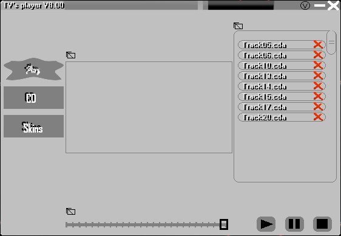



## TV's music player

### Description

|Updated| - There was an error starting up "Path not found", and it had been fixed now!

Include musicplayer and skin package maker!

This music player has it all, ripping you're cd's, playlist that supports cd-audio and normal media types, skin support and save the playlist!

This music player is made by forms, with api I made a kind like active X controls, but it uses less memory!

Give comments or vote if you like it!
 
### More Info
 

             |
---                |---
**Submitted On**   |2006-08-18 10:09:56
**By**             |[TV software](https://github.com/Planet-Source-Code/PSCIndex/blob/master/ByAuthor/tv-software.md)
**Level**          |Advanced
**User Rating**    |5.0 (20 globes from 4 users)
**Compatibility**  |VB 6\.0
**Category**       |[Sound/MP3](https://github.com/Planet-Source-Code/PSCIndex/blob/master/ByCategory/sound-mp3__1-45.md)
**World**          |[Visual Basic](https://github.com/Planet-Source-Code/PSCIndex/blob/master/ByWorld/visual-basic.md)
**Archive File**   |[TV's\_music2014698202006\.zip](https://github.com/Planet-Source-Code/tv-software-tv-s-music-player__1-66304/archive/master.zip)

